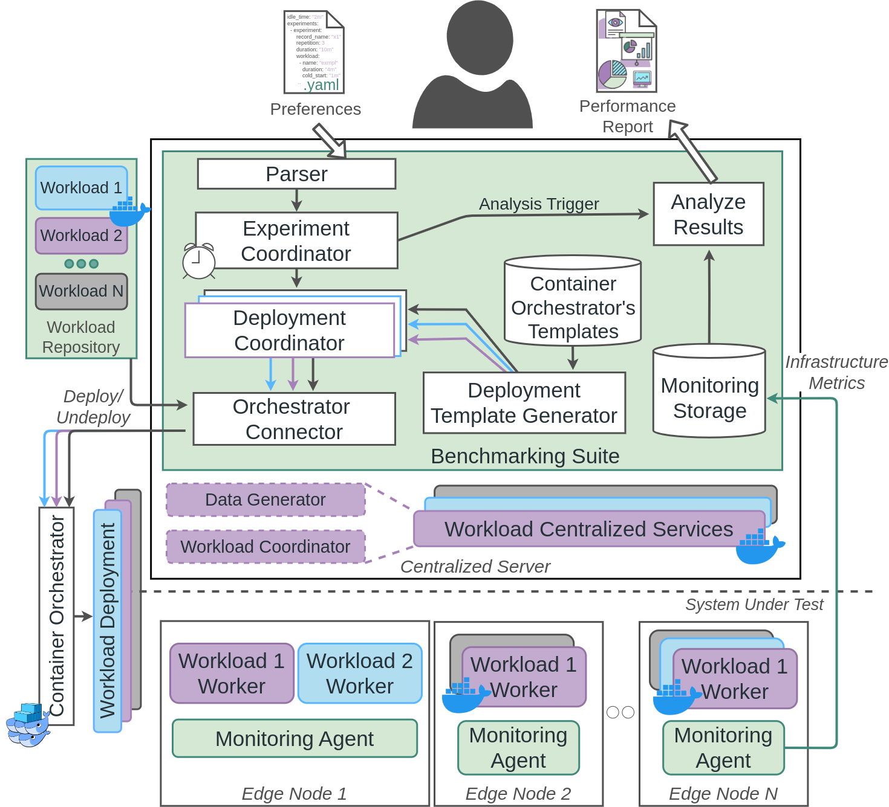

# <strong style="color: #40897B">BenchPilot</strong>
BenchPilot: Repeatable & Reproducible Benchmarking for Edge Micro-DCs

BenchPilot is a modular and highly customizable benchmarking framework for edge micro-DCs. 
BenchPilot provides a high-level declarative model for describing experiment testbeds and scenarios that automates the benchmarking process using various workloads. The latter enables users to focus on performance analysis instead of dealing with the complex and time-consuming setup. BenchPilot instantiates the underlying cluster, performs repeatable experimentation, and provides a unified monitoring stack in heterogeneous Micro-DCs. 

   

 

### <strong>Experiment Setup</strong>
A typical workflow starts with the user submitting in a yaml file their choice of experiments, along with their selected workloads and their specific parameters.
The BenchPilot model is composed with <i>Experiments</i>, where each <i>Experiment</i> has its own <i>Workload</i> descriptions. More information regarding the experiment setup can be found <a href="https://ucy-linc-lab.github.io/BenchPilot/docs/experiments/">here</a>.

### <strong>Deployment</strong>
When the description is ready, the user deploys the experiments using the BenchPilotSDK through a Jupyter notebook or a simple python script.
If there's no validation error from the description, the Parser will parse each experiment one-by-one and its preferences to the BenchPilot Deployment Template Generator, where the preferences will be transformed into docker-compose templates. At last, the Deployment Coordinator will deploy each experiment to the underlying orchestrator and closely monitor its performance through the monitoring stack. At the beginning and end of each experiment, the Coordinator records the starting/ending timestamps, so that the user can retrieve the monitored information later on.

### <strong>Monitoring</strong>
For extracting various infrastructure utilization metrics, including CPU, Memory, Network and Power Utilization, BenchPilot offers a transparent, from the application under test, monitoring stack. To achieve this, BenchPilot, in the bootstrapping stage, instantiates a containerized monitoring agent on every node. The agent inspects system information (e.g., performance pseudofiles and cgroup files) and extracts the required metrics in a non-intrusive way. The agent starts various probes, one for each sub-component (e.g., cgroup probe, OS probe, etc.), and exposes an API through which a centralized monitoring server retrieves the data periodically and stores them to the monitoring storage. Furthermore, the monitoring agent offers probes for external resources as well. From the implementation perspective, we have selected <i><a href="https://www.netdata.cloud/">Netdata</a></i>, a widely known and used monitoring tool, and <i><a href="https://www.prometheus.io/">Prometheus</a></i>, an open-source and popular monitoring server, for our stack. For a monitoring storage backend, <i><a href="https://www.influxdata.com/">InfluxDB</a></i> is used.

### <strong>Post-Experiment Analysis</strong>
To create an end-to-end interactive analytic tool for benchmarking, BenchPilot utilizes the Jupyter Notebook stack. Specifically, after the experimentation process is over, the user can request the monitored metrics of each execution from the monitoring storage based on the provided experiments' starting/ending timestamps. Users can apply high-level analytic models to the retrieved metrics of each experiment and have a clear overview of their deployments.

### <strong>Workload List</strong>
As for now BenchPilot only supports the following containerized workloads:
|Name|Description|
|----|-----------|
|marketing-campaign| A streaming distributed workload that features an application as a data processing pipeline with multiple and diverse steps that emulate insight extraction from marketing campaigns. The workload utilizes technologies such as [Kafka](https://kafka.apache.org/) and [Redis](https://redis.io/).
|mlperf| An inference workload, that includes tasks such as image classification and object recognition.
|db|A nosql database workload that keeps executing CRUD operations (Create, Read, Update and Delete).
|simple| This workload represents simple stressors that target a specific resource to stress. Underneath uses the linux command [stress](https://linux.die.net/man/1/stress) or [IPerf3](https://man.archlinux.org/man/iperf3.1.en).

<strong>You can find more information for each workload <a href="https://ucy-linc-lab.github.io/BenchPilot/docs/workloads/">here</a>. It's important to note that BenchPilot can be easily extended to add new workloads.</strong>

## <strong>Resources</strong>

### <strong>The Team</strong>
The creators of the BenchPilot are members of the [Laboratory for Internet Computing (LInC), University of Cyprus](http://linc.ucy.ac.cy/).
You can find more information about our research activity visit our publications' [page](http://linc.ucy.ac.cy/index.php?id=12) and our [on-going projects](http://linc.ucy.ac.cy/index.php?id=13).

### <strong>Acknowledgements</strong>
This work is partially supported by the EU Commission through [RAINBOW](https://rainbow-h2020.eu/)  871403 (ICT-15-2019-2020) project 
and by the Cyprus Research and Innovation Foundation through COMPLEMENTARY/0916/0916/0171 project, and from [RAIS](https://rais-itn.eu/) (Real-time analytics for the Internet of Sports), Marie Skłodowska-Curie Innovative Training Networks (ITN), under grant agreement No 813162.

### <strong>License</strong>
The framework is open-sourced under the Apache 2.0 License base. The codebase of the framework is maintained by the authors for academic research and is therefore provided "as is".

<a href="https://ucy-linc-lab.github.io/BenchPilot/docs/installation/"><strong>Start experimenting by installing Benchpilot now!</strong>